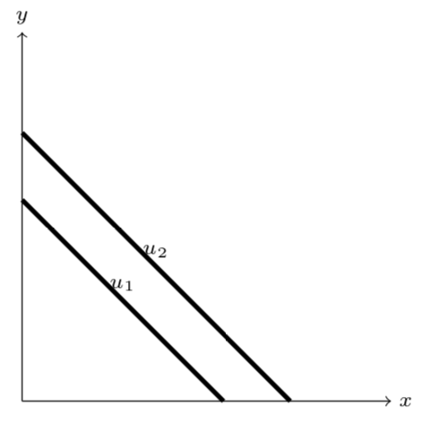
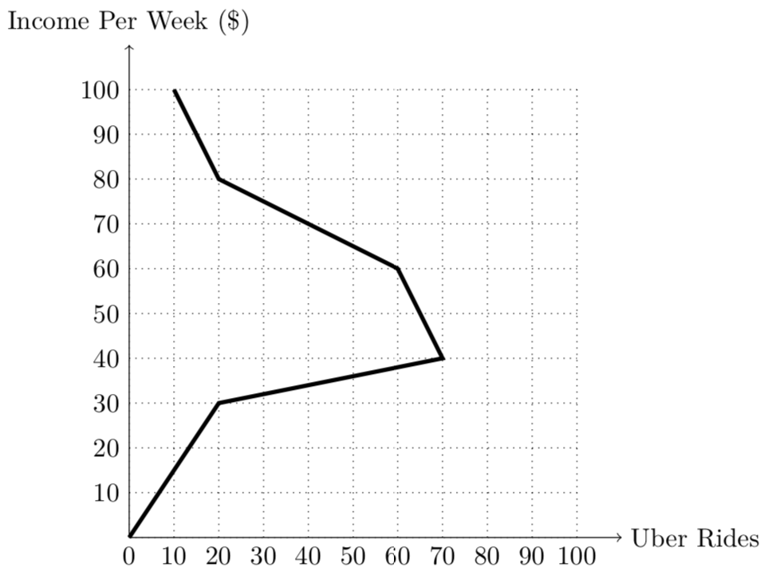
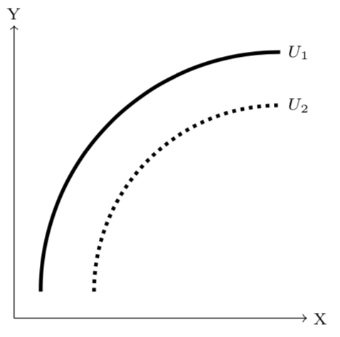
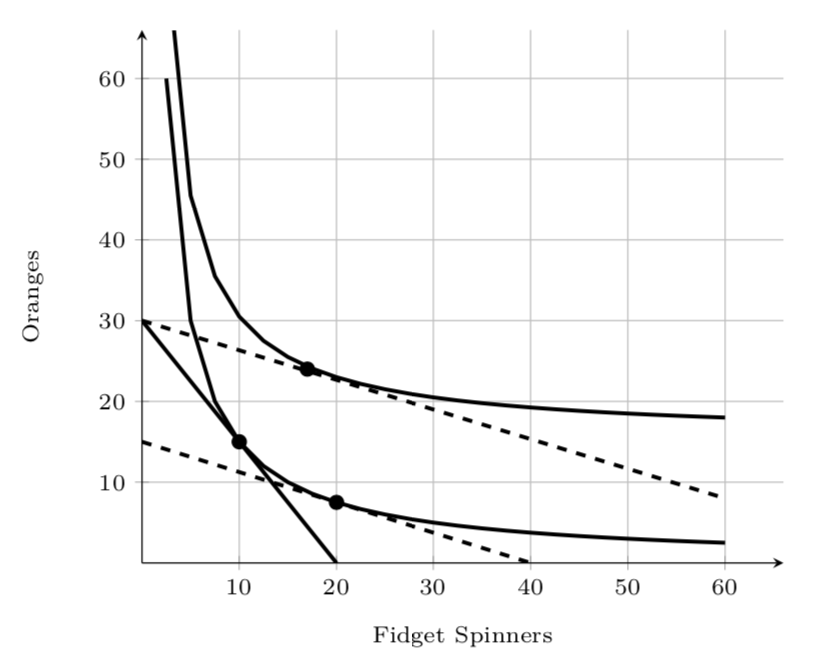

```{r setup, include=FALSE}
knitr::opts_chunk$set(echo = TRUE)
```

## True/False/Uncertain and \emph{Explain} (5 points each)

Choose any **four (4)** of the following questions. Indicate whether the following statements are **True**, **False**, or **Uncertain** (1 point), and give a short (2-3 sentences) **explanation** (4 points).

1. Emily just received a big promotion at her law firm, which comes with a 30\% pay raise. Since receiving this promotion, she has bought 15\% more gas than usual, and 40\% more food. For Emily, gas is a \emph{necessity good} and food is a \emph{luxury good}.  

---

**True.**

**Since the income elasticity of demand for gas is $\frac{\% \Delta \text{gas}}{\% \Delta m} = \frac{15\%}{30\%} = 0.50$ (less than 1), gas is a necessity. For every 1\% income increases, she buys 0.50\% more gas.**

**Since the income elasticity of demand for food is $\frac{\% \Delta \text{gas}}{\% \Delta m} = \frac{40\%}{30\%} = 1.33$ (greater than 1), gas is a luxury For every 1\% income increases, she buys 1.33\% more food.**


---

2. All else equal, we would expect a person travelling alone to have a *higher* price elasticity of demand for air travel than a family traveling together. 

---

**False**. 

**A person travelling alone likely has a _lower_ price elasticity of demand (i.e. their demand would be _inelastic_) since they are probably not as price sensitive than the family travelling together.**

**Imagine the single traveller is a businesswoman who _needs_ to be in a particular city tomorrow for an important meeting. She will not care what the price is, she will fly regardless of the price. In contrast, a family is probably much more price sensitive (high price elasticity) - perhaps they are looking to fly on vacation together, and are looking for deals, or may avoid flying altogether if the price is too high.**

**There may be other answers depending on what you envision the different purposes of the two fliers are, so long as you give a good reason why one will have a higher elasticity than the other.**

---

\clearpage

3. The graph below shows two indifference curves between two goods, $x$ and $y$. 
	


Based on the graph, the *cross price elasticity* between $x$ and $y$ is *positive*.

---

**True.**

**The graph indicates that $x$ and $y$ are _perfect substitutes_. Perfect substitutes have a positive cross-price elasticity of demand.**

\clearpage

4. Based on the Engel curve for Uber rides below, Uber rides are always a normal good.



---

**False.**

**Uber rides are a normal good for an income of less than $40/per week. For an income of higher than $40/week, Uber rides are an inferior good.**


\clearpage

5. The graph below shows two indifference curves between two objects, $X$ and $Y$. If the consumer enjoys a higher level of utility on $U_2$ than on $U_1$, then $X$ is a bad, $Y$ is a good.



---

**False.**

**The person gets higher utility moving down and to the right (less of $Y$, more of $X$), so $X$ must be a good and $Y$ must be a bad.**

\clearpage

6. The graph below depicts a *fall* in the price of Fidget Spinners.



According to the graph, Fidget Spinners are a *normal* good. 

---

**False.**

**The problem tells us that fidget spinners _decrease_ in price, so we know that we must start at the optimum on the steeper budget constraint (solid line, with higher price of fidget spinners), and ultimately reach the optimum on the flatter budget constraint (dashed line, with the lower price of fidget spinners). Consistent with our diagrams in class, label the initial optimum as A, and the new optimum as C.**

**To show the substitution effect - how the consumer would change their optimal consumption under the _new_ relative prices (cheaper fidget spinners) and get the _same_ utility as before - we shift the new budget constraint inwards parallel so that it is tangent to the original indifference curve at a new point, B. The substitution effect is from $A \rightarrow B$.**

**The real income effect - how how the consumer would change their optimal consumption due to the increase in real income (purchasing power) from the cheaper fidget spinners - gets us from $B$ to the new optimum on the higher indifference curve at $C$. Since this is a movement to the _left_ from $B$, she buys _fewer_ fidget spinners from the greater real income, the real income effect is _negative_, implying _fidget spinners are an inferior good_.**

\clearpage

## Short Answer (10 points each)

Choose any \textbf{three (3)} questions to answer concisely (2-3 sentences). If applicable, show all work and clearly label all graphs.

7. Consider four objects: $a$, $b$, $c$, and $d$. If a person's utility function over them is
$$u(a,b,c,d)=a*b-c$$
then what kind of object is $a$, $b$, $c$, and $d$, respectively?

---

**$a$ and $b$ are goods, since they enter the utility function positively $(\uparrow a \implies \uparrow u$ and $\uparrow b \implies \uparrow u)$.**

**$c$ is a bad, because it enters the utility function negatively $(\uparrow c \implies \downarrow u)$.**

**$d$ is a neutral, since it does not enter the utility function at all. Having any amount of $d$, or any change in $d$ does not change utility at all.**

---

8. Explain verbally, and with a graph, the difference between a change in demand and a change in quantity demanded.

---

**A change in _quantity demanded_ is a movement _along_ an existing demand curve: a change in optimal consumption arising from a change in _price_.**

**A change in _demand_ is a _shift_ that creates an entirely new demand curve, arising from a change in anything _other than price_ (i.e. income, price of other goods, number of buyers, etc).** 

---

9. If we are drawing an indifference curve that includes a \emph{bad} on at least one axis, which \emph{assumption(s)} of indifference curves do we violate, and why?

---

**We violate the assumption of _monotonicity_, that "having more is preferred to having less." Clearly, having more of a bad is _not_ preferred to having less, quite the opposite in fact.**

\clearpage

10. Ashkar has the following preferences over bundles of (apples, bananas):
$$(2,6) \sim (4,2) \succ (2,0) \sim (1,2)$$

Which of the following utility functions could describe his preferences? Explain why, briefly. 

i. $u(a,b) = 2a+b$
ii. $u(a,b) = 4ab$
iii. $u(a,b) = 6a+3b$
iv. $u(a,b) = a^{2} b^{2}$

---

**Plug in bundles into each candidate utility function to see if we get utility levels consistent with Ashkar's preferences. He is indifferent between (2,6) and (4,2), and is indifferent between (2,0) and (1,2), but prefers either in the first pair more than either in the second pair.**

**A quick way to rule out some of the functions is to see that his preferences imply he is indifferent between (2,0) and (1,2). Both functions (ii) and (iv) are related by multiplication.**

**If we were to use (ii): $u(a,b)=4ab$, consuming (2,0) and (1,2) would get a utility of**

$$u(2,0)=4(2)(0)=0$$
$$u(1,2)=4(1)(2)=8$$

**Clearly, this utility function does not represent indifference between these bundles, since they have different utility.**

**Likewise, we can reject utility function (iv) since it is also related by multiplication:**
$$u(2,0)=(2)^2(0)^2=0$$
$$u(1,2)=(1)^2(2)^2=4$$

**Now we are left with functions (i) and (iii). Plug in all bundles into (i):**

$$(2,6) \sim (4,2) \succ (2,0) \sim (1,2)$$

$$\begin{aligned}
u(2,6)&=2(2)+6=10\\
u(4,2)&=2(4)+2=10\\
u(2,0)&=2(2)+0=4\\
u(1,2)&=2(1)+2=4\\
\end{aligned}$$

**This function is consistent with his preferences. Let's also check (iii):**

$$(2,6) \sim (4,2) \succ (2,0) \sim (1,2)$$

$$\begin{aligned}
u(2,6)&=6(2)+3(6)=30\\
u(4,2)&=6(4)+3(2)=30\\
u(2,0)&=6(2)+3(0)=12\\
u(1,2)&=6(1)+3(2)=12\\
\end{aligned}$$

**This function is also consistent with his preferences, so _both (i) and (iii) work. This is because (iii) is a positive monotonic transformation of (i): it is just (i) multiplied by 2, preserving the ordering!**

\clearpage

## Problem (30 points)

Show all work. You may *not* earn full credit if you only write the answer, even if correct.

11. Suppose you can buy Drinks ($D$) and Wings ($W$) at a local bar.

a. Suppose you have a budget of \$120/month to spend, the price of a Drink is \$3.00, and the price of a plate of Wings is \$4.00. Write a *graphable* equation for the budget constraint, and graph it on the first graph below. (3 points)

---

$$\begin{aligned}
3D+4W&=120\\
4W&=120-3D\\
W&=30-0.75D\\
\end{aligned}$$

**See original red line on first graph below.**

---

b. Suppose you earn utility according to the function:

$$\begin{aligned}
u(D,W)&=DW\\
MU_D&=W\\
MU_W&=D\\
\end{aligned}$$

Write an equation for your *marginal rate of substitution* between $D$ and $W$.  (3 points)

---

$$\begin{aligned}
MRS_{D,W} &=\frac{MU_D}{MU_W}\\
MRS_{D,W} &=\frac{W}{D}\\
\end{aligned}$$

---

c. Calculate the *optimum* quantities of $D$ and $W$ that maximizes your utility subject to your constraints. Plot this point on the first graph below, (call it point *A*), and sketch an indifference curve through that point. (10 points)

---

$$\begin{aligned}
\frac{MU_D}{MU_W}&=\frac{p_D}{p_W}\\
\frac{W}{D}&=\frac{3}{4}\\
W&=\frac{3}{4}D\\
\end{aligned}$$

**Plug this into the budget constraint:**

$$\begin{aligned}
3D+4W&=120\\
3D+4(\frac{3}{4}D)&=120\\
3D+3D&=120\\
6D&=120\\
D^*&=20\\
\end{aligned}$$

**Knowing $D^*=20$, we can find $W^*$:**

$$\begin{aligned}
W&=\frac{3}{4}D\\
W&=\frac{3}{4}(20)\\
W^*&=15\\
\end{aligned}$$

**This point, $(D^*, W^*) = (20,15)$ is plotted as point $A$ on the first graph below.**

---

d. How much utility do you earn from the optimum bundle (point *A*)? (1 point)

---

$$\begin{aligned}
u(D,W)&=DW\\
u(20,15)&=20*15\\
u(20,15)&=300\\
\end{aligned}$$

---

e. Now suppose the price of Drinks ($D$) *rises* to \$4.00. Find the equation of the *new budget constraint* (in *graphable* form), and add it to the first graph below. (3 points)

---

$$\begin{aligned}
4D+4W&=120\\
4W&=120-4D\\
W&=30-D\\
\end{aligned}$$

**See new dotted red line on first graph below.**

---

f. Calculate the *new optimum* quantities of $x$ and $y$ under this new price. Plot this point on the first graph below, (call it point *B*), and sketch an indifference curve through that point. Hint: the formula for MRS has not changed. (6 points)

---
$$\begin{aligned}
\frac{MU_D}{MU_W}&=\frac{p_D}{p_W}\\
\frac{W}{D}&=\frac{4}{4}\\
W&=D\\
\end{aligned}$$
**Plug this into the (new!) budget constraint:**

$$\begin{aligned}
4D+4W&=120\\
4D+4(D)&=120\\
4D+4D&=120\\
8D&=120\\
D^*_2&=15\\
\end{aligned}$$

**Knowing $D^*_2=20$, we can find $W_2^*$:**

$$\begin{aligned}
W&=D\\
W^*_2&=15\\
\end{aligned}$$

**This point, $(D^*_2, W^*_2) = (15,15)$ is plotted as point $B$ on the first graph below.**

---

g. How much utility do you earn from the new optimum bundle (point *B*)? (1 point)

---

$$\begin{aligned}
u(D,W)&=DW\\
u(15,15)&=15*15\\
u(15,15)&=225\\
\end{aligned}$$

---

h. Plot the optima from parts c and f on the *second* graph below, describing the relationship between the price of Drinks and the optimal consumption of Drinks. Connect the points. What did you just draw? (3 points)

---

```{r, echo=F, warning=F, message=F}
library(tidyverse)
library(ggrepel)
points <-tribble(
  ~x, ~y, ~letter,
  20, 15, "A",
  15, 15, "B"
)
IC_1=function(x){300/x}
IC_2=function(x){225/x}

budget_1 = function(x){30-0.75*x}
budget_2 = function(x){30-x}

ggplot(tibble(x=c(0,10)), aes(x=x))+
  stat_function(fun=IC_1, geom="line", size=2, color = "green")+
  stat_function(fun=IC_2, geom="line", size=2, color = "blue")+
  stat_function(fun=budget_1, geom="line", size=2, color = "red")+
  stat_function(fun=budget_2, geom="line", size=2, color = "red", linetype="dashed")+
  geom_segment(x=0, xend=20,y=15,yend=15, linetype="dotted")+
  geom_segment(x=15, xend=15,y=15,yend=0, linetype="dotted")+
  geom_segment(x=20, xend=20,y=15,yend=0, linetype="dotted")+
  geom_point(data=points, aes(x=x,y=y), size=3)+
  geom_label_repel(data=points, aes(x=x,y=y, label=letter), size=5)+
    scale_x_continuous(breaks=seq(0,50,5),
                     limits=c(0,50),
                     expand=expand_scale(mult=c(0,0.1)))+
  scale_y_continuous(breaks=seq(0,50,5),
                     limits=c(0,50),
                     expand=expand_scale(mult=c(0,0.1)))+
  labs(x = "Drinks (D)",
       y = "Wings (W)")+
  theme_bw(base_size=16)
```

```{r, echo=F, warning=F, message=F}
library(tidyverse)
library(ggrepel)
points_2 <-tribble(
  ~x, ~y, ~letter,
  20, 3, "A",
  15, 4, "B"
)
demand=function(x){7-0.2*x}

ggplot(tibble(x=c(0,10)), aes(x=x))+
  stat_function(fun=demand, geom="line", size=2, color = "blue")+
  geom_label(aes(x=30, y=1),label = "Demand", color = "blue")+
  geom_segment(x=0, xend=20,y=3,yend=3, linetype="dotted")+
  geom_segment(x=20, xend=20,y=3,yend=0, linetype="dotted")+
  geom_segment(x=0, xend=15,y=4,yend=4, linetype="dotted")+
  geom_segment(x=15, xend=15,y=4,yend=0, linetype="dotted")+
  geom_point(data=points_2, aes(x=x,y=y), size=3)+
  geom_label_repel(data=points_2, aes(x=x,y=y, label=letter), size=5)+
    scale_x_continuous(breaks=seq(0,50,5),
                     limits=c(0,50),
                     expand=expand_scale(mult=c(0,0.1)))+
  scale_y_continuous(breaks=seq(0,5,1),
                     limits=c(0,5),
                     expand=expand_scale(mult=c(0,0.1)))+
  labs(x = "Drinks (D)",
       y = "Price per Drink (p)")+
  theme_bw(base_size=16)
```

**This is demand curve for Drinks.**

\clearpage

## Long Answer (10 points each)

Choose any \textbf{two (2)} of the following questions to answer. Please answer clearly and concisely (2-5 sentences is sufficient). If applicable, show all work and clearly label all graphs.

12. As you are taking this exam, you are implicitly solving a constrained optimization problem. Briefly explain what your objective is, what your constraint is, and what choices and tradeoffs you must make to attain this objective. \emph{Be specific}, in the context of taking an exam (meaning, we're not talking about utility and dollars, etc). 

---

**I will accept slight variations, but in general:**

**You are choosing questions to work on, in order to maximize points on the exam, subject to the limited amount of time.**

---

13. Explain the difference between the *income effect* and the *real income effect.* Use an example of an *inferior* good in describing each effect. 

---

**The _income effect_ describes how optimal consumption changes when income changes. For an inferior good, an _increase in income_ will result in a _decrease in consumption_ of that good.**

**The _real income effect_ describes how optimal consumption changes when _the price of that good_ changes. For an inferior good, a _decreases in the price of that good_ will result in a _smaller than otherwise increase in consumption of that good_, since, when combined with the substitution effect, the law of demand implies a decrease in price causes an increase in consumption of that good.**

**The key is recognizing the first effect focuses on _nominal_ income (i.e. paycheck) changing, whereas the second effect focuses on the _price of a good_ changing. Additionally, the _real_ income effect is just _one_ of the results of consumption changes from a price change (since the change in price changes purchasing power), the other being the substitution effect, which both combined yield the price effect (law of demand). Even for an inferior good, the law of demand holds due to the substitution effect dominating the real income effect.** 

---

14. Suppose someone argues that although a hurricane hitting an area is a terrible tragedy, it is an economic blessing in disguise. After a hurricane has ravaged an area, all of the homes and businesses need to be rebuilt. This will create new demand for construction, homebuilding, and restocking the stores in the area, which will lead to new jobs to help with the rebuilding and restoring all of the businesses in the area. All of this will stimulate the economy and create jobs in a way that would not happen had it not been for the hurricane. Respond to this argument.
 
---

**This is just a version of the "Broken Window" story we learned the second day of class. It is true that the aftermath of the hurricane will indeed cause people to spend and produce new houses and buildings, but this argument is incomplete as it only focuses on the _seen_, the benefits. If this were all that there was to it, we in fact should be _hoping_ for more hurricanes because they will stimulate the economy!**

**We must also think of the _unseen_, the _opportunity costs_ of rebuilding. The resources and jobs that must go into rebuilding the area will be taken out of other uses in the economy. Additionally, hurricanes destroy wealth - had the hurricane _not_ hit, resources would be put towards producing all sorts of things that now will no longer exist because of the hurricane's damage.**

\clearpage

## Formulas

$$p_xX+p_yY=m$$

$$\epsilon_{q,p}=\frac{1}{slope}\times \frac{p}{q}$$

$$\epsilon_{q,m}=\frac{\% \Delta q}{\% \Delta m}$$

$$\epsilon_{q_x,p_y}=\frac{\% \Delta q_x}{\% \Delta p_y}$$

- Two curves are *tangent* at a point $\iff$ two curves have the same slope *at that point*